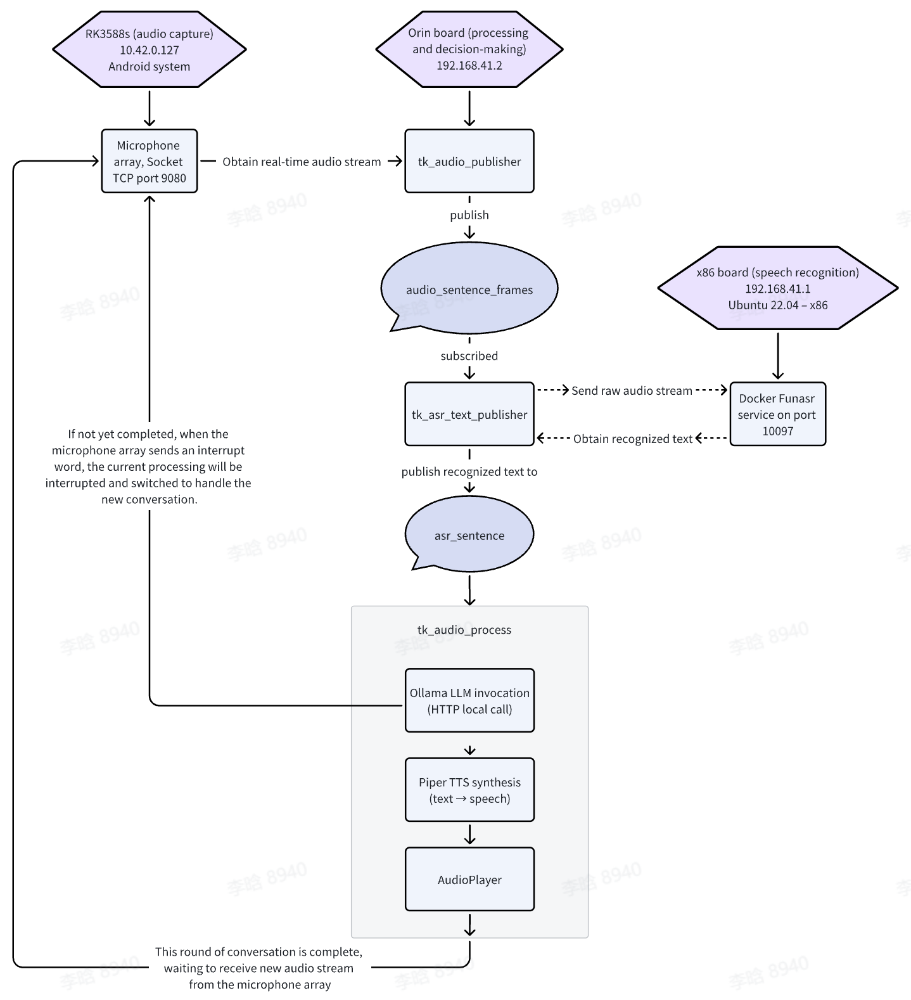

# TKVoice Comprehensive Technical Guide

## Table of Contents
1. [Project Overview](#project-overview)
2. [System Architecture](#system-architecture)
3. [Core Concepts](#core-concepts)
4. [Module Detailed Explanation](#module-detailed-explanation)
5. [Implementation Details](#implementation-details)
6. [Development Notes](#development-notes)
7. [Frequently Asked Questions](#frequently-asked-questions)

---

## Project Overview

### What is TKVoice?

**TKVoice** is a complete **offline speech interaction system based on TianGong (TG) platform**, integrating three core functionalities:

| Function | Abbreviation | Purpose | Analogy |
|----------|--------------|---------|---------|
| Automatic Speech Recognition | ASR | Convert **user's speech** to **text** | Converting speech to typing |
| Large Language Model | LLM | Understand text, generate **answer text** | Understanding questions and thinking |
| Text-to-Speech | TTS | Convert **text** to **machine speech** | Converting text to speech |

### Complete Speech Interaction Flow

```
User speaks
    ↓
[ASR] Speech Recognition → Get text
    ↓
[LLM] Large Language Model → Generate answer
    ↓
[TTS] Text-to-Speech → Generate speech
    ↓
Machine speaks
```

### Why Use Offline Solution?

- ✅ **Privacy Protection** - Data stays local, no cloud transmission
- ✅ **Low Latency** - Unaffected by network, real-time interaction
- ✅ **High Reliability** - Network-independent, no cloud service accounts required
- ✅ **Cost-Effective** - One-time deployment, no service fees
- ⚠️ **High Resource Requirements** - Requires strong computing power

---

## System Architecture

### Hardware Topology

The project uses a **multi-machine collaborative** architecture, with the **Orin board as the core orchestrator**:



### IP Address Configuration

| Device | IP Address | Function | Port |
|--------|-----------|----------|------|
| RK3588s | 10.42.0.127 | Audio acquisition and playback | 9080 |
| **Orin Board** | **192.168.41.2** | **ROS 2 System + Ollama LLM + Piper TTS** | **11434** |
| x86 Server | 192.168.41.1 | Funasr ASR Service | 10097 |

### Network Communication Protocol Details

#### 1. RK3588s ↔ Orin Board (Socket TCP)

```
RK3588s Microphone
    ↓
Audio Stream (16000 Hz, 16-bit PCM)
    ↓
Socket TCP Connection (10.42.0.127:9080)
    ↓ (Send raw audio)
tk_audio_publisher (Determine complete sentence by VAD field and receive audio)
    ↓
ROS audio_sentence_frames Topic
    ↓
tk_asr_text_publisher (Subscription)
```

The TCP data packets provided on port 9080 of the RK3588s board will be explained in detail below.

#### 2. Orin Board ↔ x86 Server (WebSocket)

```
tk_asr_text_publisher (Orin Board)
    ↓
WebSocket Client Connection
    ↓
192.168.41.1:10097 (x86 Server Funasr)
    ↓
Send complete audio sentence
    ↓
Funasr Model Recognition
    ↓
Return recognition result
    ↓
Obtain final recognition text
```

#### 3. Orin Board Internal (Local Ollama + Piper TTS)

```
tk_audio_process (Receive recognition text)
    ↓
Ollama LLM Client (HTTP)
    ↓
localhost:11434/api/chat (Local Ollama Service)
    ↓
qwen2.5:1.5b Model Streaming Generation of Answer
    ↓
Wait for streaming return of answer text suitable for single sentence playback
    ↓
Piper TTS (Local Call)
    ↓
ONNX Model Inference: Text→Speech Waveform
    ↓
AudioPlayer Playback
    ↓
Continue playback until Ollama LLM Client generation completes
```

### Key Points Summary

| Level | Processing Location | Technology | Description |
|-------|-------------------|-----------|-------------|
| **Audio Acquisition** | RK3588s | Microphone Array + Socket | Raw audio sent via Socket to Orin |
| **Audio Reception & Publishing** | Orin Board | tk_audio_publisher (ROS) | Receive raw audio, publish by complete sentences |
| **Speech Recognition** | Orin Sends, x86 Processes | WebSocket + Funasr Docker | Orin sends audio via WebSocket to x86 for recognition |
| **Text Publishing** | Orin Board | tk_asr_text_publisher (ROS) | Recognition results published to ROS topic |
| **LLM Processing** | Orin Board | Ollama HTTP API | Local Ollama call, generate answer (streaming) |
| **TTS Synthesis** | Orin Board | Piper ONNX + Pytorch | Local Piper call, generate speech waveform |
| **Audio Playback** | Orin Board | AudioPlayer (PyAudio) | Queue-based playback, return to RK3588s via Socket |

---

## Core Concepts

### 1. ROS 2 Middleware

TKVoice is a **ROS 2** project using the publish-subscribe pattern for data transmission.

**ROS Analogy:**
- Imagine multiple independent programs that need to communicate through "Topics"
- One program "publishes" data, other programs "subscribe" to data
- Like newspapers: publishers distribute (publish), readers subscribe and read

**ROS Topics in This Project:**

| Topic Name | Data Type | Publisher | Subscriber | Meaning |
|-----------|-----------|-----------|-----------|---------|
| `audio_frames` | AudioFrame | tk_audio_publisher | Internal | Single audio frame |
| `audio_sentence_frames` | AudioFrame | tk_audio_publisher | tk_asr_text_publisher | Complete sentence audio |
| `asr_sentence` | String | tk_asr_text_publisher | tk_audio_process | Recognition text |

### 2. Threading and Asynchronous Programming

TKVoice extensively uses **multithreading** to handle concurrent tasks:

```python
import threading

# Create a background thread
thread = threading.Thread(target=some_function, daemon=True)
thread.start()

# Thread runs parallel to main thread
```

**Why Multithreading is Needed:**

In speech interaction, multiple tasks must occur simultaneously:
- Receive audio data (I/O intensive)
- Send data to ASR service (network I/O intensive)
- Process LLM answer (compute intensive)
- Play speech (I/O intensive)

Single-threaded approach would cause blocking: audio reception blocked during answer processing.

### 3. Queue Data Structure

```python
from queue import Queue

q = Queue(maxsize=1)  # Store maximum 1 element

# Put data
q.put(data)

# Get data
data = q.get(timeout=2)  # Wait 2 seconds, timeout if no data
```

**Queue Benefits:**
- Thread-safe data passing between threads
- Implement producer-consumer pattern
- Automatic thread synchronization

### 4. WebSocket Real-time Communication

WebSocket is a **bidirectional real-time communication protocol**:

```
Regular HTTP (Request-Response):    WebSocket (Persistent Connection):
Client → Server                     Client ↔ Server
  ↓                                  ↓
Get Response → Close Connection     Keep Connection, Send/Receive Anytime
  ↓                                  ↓
Repeat                              Streaming Processing
```

**Application in TKVoice:**
- When communicating with Funasr, use WebSocket to send audio chunks
- Funasr returns results while recognizing (streaming)

### 5. Audio Processing Basics

**Sample Rate:** 16000 Hz = 16000 samples per second
**Bit Depth:** 16 bit = 2 bytes per sample
**Channels:** 1 = Mono

Calculation: 1 second audio size = 16000 × 2 = 32000 bytes ≈ 31 KB

---

## Module Detailed Explanation

### First Layer: Audio Acquisition Module

#### Module Files
- `socket_connector.py` - Socket connection management
- `socket_audio_provider.py` - Audio reception and parsing
- `tk_audio_publisher.py` - Publish audio to ROS

#### Data Flow

```
RK3588s Microphone Array
    ↓
Socket Server (IP: 10.42.0.127, Port: 9080)
    ↓
SocketConnector Establish Connection
    ↓
SocketAudioProvider Receive Raw Data
    ↓
SocketAudioPublisher Publish to ROS Topic
```

#### Key Concept: VAD (Voice Activity Detection)

When receiving audio data, need to identify **when speaking vs. silence**:

```
VAD Status Code:
  0 = Silence
  1 = Start Speaking (New sentence begins)
  2 = Continuous Speaking
  3 = End Speaking (Sentence ends)
```

**Implementation Logic:**

```python
def keep_receiving_publish_audio():
    while True:
        audio_data, vad = socket_provider.read()
        
        if vad == 1:  # Start speaking
            audio_buffer.clear()  # Clear old data
            audio_buffer.extend(audio_data)
        
        elif vad == 2:  # Continuous speaking
            audio_buffer.extend(audio_data)  # Continue appending
        
        elif vad == 3:  # End speaking
            audio_buffer.extend(audio_data)
            # Complete sentence audio ready, publish to topic
            publish_sentence(audio_buffer)
            audio_buffer.clear()
```

#### Code Explanation: SocketConnector

```python
class SocketConnector:
    def __init__(self, ip: str, port: int):
        # Create TCP Socket
        self.client_socket = socket(AF_INET, SOCK_STREAM)
        
        # Connect to server
        self.client_socket.connect((ip, port))
        
        # Set receive timeout 3 seconds
        self.client_socket.settimeout(3.0)

    def receive_full_data(self, expected_length):
        """
        Receive complete data block
        
        Since TCP is a stream protocol, data may be received in multiple chunks:
        For example, to receive 1000 bytes, may get 500 first, then 500
        """
        received_data = bytearray()
        
        while len(received_data) < expected_length:
            # Receive up to 4096 bytes at a time
            chunk = self.client_socket.recv(4096)
            
            if not chunk:  # Server closed connection
                return None
            
            received_data.extend(chunk)
        
        return bytes(received_data)
```

#### Code Explanation: SocketAudioProvider

This is the detailed code for receiving audio data from RK3588s. Why this approach? TianGong Wander is equipped with iFLYTEK's RK3588 AIUI multimodal development kit. Its audio transmission protocol is at: https://aiui-doc.xf-yun.com/project-1/doc-392/

It clearly specifies that bytes 0-8 are the request header, corresponding to `header = self.receive_full_data(9)` below. Byte 9 is the VAD field, corresponding to `vad = body[0]` in the code below. Bytes 17 to n are the detailed audio data, corresponding to `audio_data = body[8:-1]` below.

```python
class SocketAudioProvider(SocketConnector):
    def read(self):
        """Parse audio packet protocol"""
        
        # 1. Receive 9-byte header
        header = self.receive_full_data(9)
        # Format: [Sync, UserID, MessageType, MessageLength, MessageID]
        # Binary format: 1 byte + 1 byte + 1 byte + 2 bytes + 4 bytes
        
        sync_head, user_id, msg_type, msg_length, msg_id = struct.unpack(
            '<BBBIH',  # < = little-endian, B=byte, I=int, H=short
            header
        )
        
        # 2. Validate header
        if sync_head != 0xa5 or user_id != 0x01:
            return None  # Invalid packet
        
        # 3. Receive message body
        body = self.receive_full_data(msg_length + 1)
        # Format: [VAD, Channel, ...] + CRC checksum byte
        
        vad = body[0]  # VAD status
        audio_data = body[8:-1]  # Extract audio data
        
        return audio_data, vad
```

#### Code Explanation: SocketAudioPublisher

```python
class SocketAudioPublisher(Node):
    def __init__(self):
        super().__init__('tk_audio_publisher')
        
        # Create two publishers
        self.publisher_ = self.create_publisher(
            AudioFrame,          # Message type
            'audio_frames',      # Topic name
            10                   # Queue size
        )
        
        self.sentence_publisher_ = self.create_publisher(
            AudioFrame,
            'audio_sentence_frames',
            10
        )
        
        # Create Socket provider
        self.audio_provider = SocketAudioProvider('10.42.0.127', 9080)
        
        # Start background receiving thread
        self.receive_pub_thread = threading.Thread(
            target=self.keep_receiving_publish_audio
        )
        self.receive_pub_thread.start()

    def keep_receiving_publish_audio(self):
        """Background thread: continuously receive and publish audio"""
        audio_buffer = bytearray()
        
        while not self.stop_event.is_set():
            audio_res = self.audio_provider.read()
            
            if audio_res is None:
                continue
            
            audio_data, vad = audio_res
            
            if vad == 1:  # Start speaking
                audio_buffer.clear()
                audio_buffer.extend(audio_data)
                
            elif vad == 2:  # Continuous speaking
                audio_buffer.extend(audio_data)
                
            elif vad == 3:  # End speaking
                audio_buffer.extend(audio_data)
                
                # Publish complete sentence audio
                msg = AudioFrame()
                msg.data = bytes(audio_buffer)
                self.sentence_publisher_.publish(msg)
                
                self.get_logger().info(
                    f"Published complete audio, length: {len(audio_buffer)}"
                )
                
                audio_buffer.clear()
```

---

### Second Layer: Speech Recognition Module (ASR)

#### Module Files
- `funasr_client.py` - Funasr WebSocket client
- `tk_asr_text_publisher.py` - ASR text publishing

#### Data Flow

```
audio_sentence_frames Topic
    ↓
tk_asr_text_publisher Subscribe
    ↓
funasr_client WebSocket Send Audio
    ↓
x86 Funasr Service Recognition
    ↓
WebSocket Return Recognition Result
    ↓
asr_sentence Topic Publish
```

#### Core Concept: WebSocket Streaming Recognition

```
// 1. Connect to WebSocket server
ws = websocket.connect("wss://192.168.41.1:10097")

// 2. Send handshake message (tell server recognition parameters)
ws.send({
    "mode": "offline",      // Offline mode
    "sample_rate": 16000,   // Sample rate
    "chunk_size": [5,10,5]  // Audio chunk size for each send
})

// 3. Send audio in chunks (streaming)
for chunk in audio_chunks:
    ws.send_binary(chunk)

// 4. Receive recognition results (also streaming)
for result in ws.recv():
    text = result["text"]
    print(f"Recognition result: {text}")
```

#### Code Explanation: FunASRClient

```python
class FunASRClient:
    def __init__(self, host="192.168.41.1", port=10097):
        self.host = host
        self.port = port
        self.ssl_enabled = True  # Use WSS encrypted connection
        
        # Recognition parameter configuration
        self.sample_rate = 16000
        self.chunk_size = [5, 10, 5]  # Audio chunk size (milliseconds)
        self.chunk_interval = 10      # Chunk interval
        
        # WebSocket connection (via global async loop)
        self.loop = GlobalAsyncLoop.get_loop()
        self.connect()

    async def _connect(self):
        """Establish WebSocket connection"""
        # Construct WebSocket URI
        uri = f"wss://{self.host}:{self.port}"
        
        # SSL context (disable certificate verification)
        ssl_context = ssl.SSLContext(ssl.PROTOCOL_TLS)
        ssl_context.check_hostname = False
        ssl_context.verify_mode = ssl.CERT_NONE
        
        # Connect
        return await websockets.connect(
            uri,
            subprotocols=["binary"],
            ping_interval=None,  # Disable heartbeat
            ssl=ssl_context
        )

    def to_text(self, audio_bytes: bytes) -> str:
        """
        Synchronous interface: input audio bytes, output recognition text
        """
        # Execute async function within async loop
        future = asyncio.run_coroutine_threadsafe(
            self._async_to_text(audio_bytes),
            self.loop
        )
        
        return future.result(timeout=30)

    async def _async_to_text(self, audio_bytes: bytes) -> str:
        """Asynchronous recognition implementation"""
        ws = await self.try_init_connection()
        
        # 1. Send handshake message
        start_signal = {
            "mode": "offline",
            "sample_rate": self.sample_rate,
            "chunk_size": self.chunk_size,
            "chunk_interval": self.chunk_interval,
        }
        await ws.send(json.dumps(start_signal))
        
        # 2. Send audio in chunks
        chunk_bytes = (self.sample_rate / 1000) * 2  # Bytes per millisecond
        
        for i in range(0, len(audio_bytes), int(chunk_bytes * 10)):
            chunk = audio_bytes[i:i+int(chunk_bytes*10)]
            await ws.send(chunk)  # Send binary data
            await asyncio.sleep(0.01)
        
        # 3. Send end signal
        await ws.send(json.dumps({"mode": "offline"}))
        
        # 4. Receive recognition result
        result_text = ""
        async for message in ws:
            data = json.loads(message)
            text = data.get("text", "")
            if text:
                result_text = text
            if data.get("done"):
                break
        
        return result_text
```

#### Code Explanation: FunASRTextPublisher

```python
class FunASRTextPublisher(Node):
    def __init__(self):
        super().__init__('tk_asr_text_publisher')
        
        # Subscribe to audio topic
        self.subscription = self.create_subscription(
            AudioFrame,
            'audio_sentence_frames',
            self.audio_sentence_callback,
            10
        )
        
        # Create publisher
        self.asr_sentence_publisher = self.create_publisher(
            String,
            '/asr_sentence',
            10
        )
        
        # Audio processing queue
        self.audio_queue = Queue(maxsize=1)
        
        # Funasr client
        self.asr_service = FunASRClient(
            host="192.168.41.1",
            port=10097
        )
        
        # Background processing thread
        self.process_thread = threading.Thread(
            target=self.keep_process_audio
        )
        self.process_thread.start()

    def audio_sentence_callback(self, msg: AudioFrame):
        """
        Subscribe callback: called when receiving complete sentence audio
        """
        # Put audio into queue
        self.audio_queue.put(msg)

    def keep_process_audio(self):
        """Background thread: process audio and recognize"""
        while True:
            try:
                # Get audio from queue (wait max 2 seconds)
                msg = self.audio_queue.get(timeout=2)
                
                # Convert to bytes
                audio_bytes = bytes(msg.data)
                
                self.get_logger().info(
                    f"Received {len(audio_bytes)} bytes audio, starting recognition..."
                )
                
                # Call Funasr for recognition
                asr_sentence = self.asr_service.to_text(audio_bytes)
                
                # Filter out too-short recognition results
                if len(asr_sentence) <= 3:
                    self.get_logger().info(f"Ignore short result: {asr_sentence}")
                    continue
                
                # Publish recognition result
                text_msg = String()
                text_msg.data = asr_sentence
                self.asr_sentence_publisher.publish(text_msg)
                
                self.get_logger().info(f"Published recognition result: {asr_sentence}")
                
            except Empty:
                continue  # Timeout, keep waiting
            except Exception as e:
                self.get_logger().error(f"Recognition error: {e}")
```

---

### Third Layer: Natural Language Understanding Module (LLM)

#### Module Files
- `ollama_client.py` - Ollama LLM client

#### Data Flow

```
asr_sentence Topic
    ↓
ollama_client Receive Text
    ↓
HTTP API Send Question to Ollama
    ↓
Ollama qwen2.5:1.5b Model Inference
    ↓
Stream Return Answer Text
    ↓
answer_text_queue Put Text
```

#### Core Concept: Streaming Generation

LLM doesn't return complete answer at once, but **streams** it word by word:

```
Question: How are you?
     ↓ (Waiting...)
Answer: I am... (1st second)
Answer: I am an... (2nd second)
Answer: I am an AI... (3rd second)
...
```

Advantage: Users can hear the beginning of the answer faster.

#### Code Explanation: OllamaChatClient

```python
class OllamaChatClient:
    def __init__(self):
        self.base_url = "http://localhost:11434"
        self.chat_url = f"{self.base_url}/api/chat"
        self.model = "qwen2.5:1.5b"  # Model to use
        
        # Conversation history (supports multi-turn dialogue)
        self.history = deque(maxlen=2)  # Keep max 2 turns
        
        # System prompt
        self.system_message = {
            "role": "system",
            "content": "You are an intelligent assistant developed by UBTech, called TianGong AI Assistant."
        }
        
        # Sentence splitting configuration (for TTS)
        self.sentence_endings = "。！？!?"
        self.max_len = 25  # Max 25 characters per sentence

    def load_model(self):
        """Warm up model: load to memory in advance"""
        # This makes subsequent recognition faster
        url = f"{self.base_url}/api/chat"
        payload = {"model": self.model, "messages": []}
        
        with httpx.stream("POST", url, json=payload, timeout=None) as resp:
            for line in resp.iter_text():
                data = json.loads(line)
                if data.get("done"):
                    break

    def stream_sentence(self, user_input: str):
        """
        Stream dialogue: return a generator that continuously produces text
        """
        # Construct message list
        messages = []
        if self.system_message:
            messages.append(self.system_message)
        
        # Add conversation history
        messages.extend(list(self.history))
        
        # Add user question
        messages.append({"role": "user", "content": user_input})
        
        # Construct request
        payload = {
            "model": self.model,
            "messages": messages,
            "stream": True  # Enable streaming mode
        }
        
        # Send HTTP POST request
        with httpx.stream("POST", self.chat_url, json=payload) as response:
            for line in response.iter_text():
                if not line:
                    continue
                
                try:
                    data = json.loads(line)
                    
                    # Extract text from response
                    message = data.get("message", {})
                    text = message.get("content")
                    
                    if text:
                        # Return to caller
                        yield text
                    
                    # Check if complete
                    if data.get("done"):
                        # Add to history
                        self.history.append({"role": "user", "content": user_input})
                        self.history.append({"role": "assistant", "content": text})
                        break
                
                except json.JSONDecodeError:
                    continue

    @staticmethod
    def _stream_worker(chat_url, model, messages_payload, queue):
        """
        Execute HTTP streaming request in subprocess
        (for multi-process concurrent processing)
        """
        payload = {"model": model, "messages": messages_payload}
        
        try:
            with httpx.stream("POST", chat_url, json=payload) as resp:
                for line in resp.iter_text():
                    if not line:
                        continue
                    
                    data = json.loads(line)
                    text = data.get("message", {}).get("content")
                    
                    if text:
                        # Put into queue (inter-process communication)
                        queue.put(text)
                    
                    if data.get("done"):
                        break
        
        except Exception as e:
            logging.error(f"HTTP request failed: {e}")
        
        finally:
            queue.put(None)  # Indicate end
```

#### Sentence Splitting Logic

Since TTS generation takes time, the project uses **sentence splitting** to generate speech in advance:

```python
def split_sentences(text: str, endings="。！？", max_len=25):
    """
    Split long text into short sentences
    
    Example:
    Input: "Hello. Very nice to meet you! Hope you have a great day."
    Output: ["Hello.", "Very nice to meet you!", "Hope you have a great day."]
    """
    sentences = []
    current = ""
    
    for char in text:
        current += char
        
        # Hit ending character or reach max length
        if char in endings or len(current) >= max_len:
            sentences.append(current)
            current = ""
    
    if current:
        sentences.append(current)
    
    return sentences
```

---

### Fourth Layer: Text-to-Speech Module (TTS)

#### Module Files
- `piper_provider.py` - Piper TTS speech synthesis

#### Data Flow

```
answer_text_queue Text
    ↓
piper_provider.tts() Synthesis
    ↓
Audio Bytes (float32 format)
    ↓
AudioPlayer.play() Playback
```

#### Core Concept: ONNX Model Inference

Piper uses **ONNX** format models (lightweight, cross-platform):

```
ONNX Model (.onnx file)
    ↓
ONNX Runtime Load
    ↓
CPU/GPU Inference
    ↓
Speech Waveform
```

#### Code Explanation: PiperProvider

```python
class PiperProvider:
    def __init__(self):
        # Model path
        MODEL_DIR = os.environ.get("MODEL_DIR", "/home/nvidia/")
        self.model_path = os.path.join(
            MODEL_DIR,
            "piper_voices/zh/zh_CN-huayan-medium.onnx"
        )
        self.tts_config_path = self.model_path + ".json"
        
        # Synthesis parameter configuration
        self.piper_syn_config = SynthesisConfig(
            length_scale=1.1,       # Speech rate: 1.0=normal, <1.0=fast, >1.0=slow
            noise_scale=0.4,         # Phoneme noise: low=clear, high=natural
            noise_w_scale=0.5,       # Intonation fluctuation: low=flat, high=natural
            normalize_audio=True,    # Auto normalize volume
            volume=1.0               # Output volume
        )
        
        # Load ONNX model
        self.piper_instance = PiperVoice.load(
            self.model_path,
            config_path=self.tts_config_path,
            use_cuda=True  # Use GPU acceleration
        )
        
        self.sample_rate = 21000  # Output sample rate

    def tts(self, text: str) -> bytes:
        """
        Text-to-Speech
        
        Input: Chinese text
        Output: Audio bytes (float32)
        """
        try:
            # Use Piper model for synthesis
            chunks = self.piper_instance.synthesize(
                text,
                syn_config=self.piper_syn_config
            )
            
            # Merge multiple audio chunks
            audio_list = [chunk.audio_float_array for chunk in chunks]
            
            if not audio_list:
                return np.array([], dtype=np.float32)
            
            # Concatenate all audio chunks
            waveform = np.concatenate(audio_list).astype(np.float32)
            
            # Convert to bytes
            return waveform.tobytes()
        
        except Exception as e:
            logging.error(f"TTS generation failed: {e}")
            return np.array([], dtype=np.float32)

    def play(self, waveform: bytes):
        """Play speech directly"""
        self.audio_stream.write(waveform)
```

#### Parameter Details

| Parameter | Description | Range | Example |
|-----------|-------------|-------|---------|
| `length_scale` | Speech rate | 0.5~2.0 | 1.1=slightly slower |
| `noise_scale` | Phoneme noise | 0.0~2.0 | 0.4=clear |
| `noise_w_scale` | Intonation fluctuation | 0.0~2.0 | 0.5=smooth |
| `normalize_audio` | Auto volume | True/False | True=maintain consistency |
| `volume` | Output volume | 0.0~2.0 | 1.0=original |

---

### Fifth Layer: Audio Playback Module

#### Module Files
- `utils.py` - AudioPlayer class

#### Core Concept: Multi-queue Playback Architecture

TKVoice supports **one question with multiple sentences**, each with independent queue:

```
Question 1
  ├─ Sentence 1A → Queue 1A → Playing
  ├─ Sentence 1B → Queue 1B → Waiting
  └─ Sentence 1C → Queue 1C → Waiting

New Question Arrives → Clear all old queues, keep new question queue
```

#### Code Explanation: AudioPlayer

```python
class AudioPlayer:
    def __init__(self):
        # PyAudio instance
        self.audio = pyaudio.PyAudio()
        self.device_info = self.audio.get_default_output_device_info()
        
        # Current question text
        self.question_text = ""
        
        # Audio queue for each question
        self.question_audio_map = {}  # {question_text: Queue}
        
        # Create audio output stream
        self.playing_stream = self.open_stream()
        
        # Playback thread
        self.playing_thread = threading.Thread(
            target=self.keep_playing_audio,
            daemon=True
        )
        self.playing_thread.start()
        
        # Flag for playback status
        self.is_speaking_event = threading.Event()

    def set_question_text(self, text: str):
        """Switch current question"""
        with self.question_lock:
            self.question_text = text
        
        # Create queue for new question
        with self.question_audio_map_lock:
            self.question_audio_map[text] = Queue()

    def stop_other_audio_and_clear_queue(self):
        """Clear audio queues of old questions"""
        current_question = self.get_question_text()
        
        with self.question_audio_map_lock:
            # Delete queues of other questions
            for q_text in list(self.question_audio_map.keys()):
                if q_text != current_question:
                    del self.question_audio_map[q_text]
        
        # Stop playback
        self.is_speaking_event.clear()

    def play(self, audio_bytes: bytes):
        """
        Put audio bytes into playback queue
        
        This will be consumed in background playback thread
        """
        question_text = self.get_question_text()
        
        with self.question_audio_map_lock:
            if question_text in self.question_audio_map:
                queue = self.question_audio_map[question_text]
                try:
                    queue.put(audio_bytes, block=False)
                except Full:
                    pass  # Queue full, discard

    def keep_playing_audio(self):
        """Background playback thread"""
        while True:
            try:
                question_text = self.get_question_text()
                
                with self.question_audio_map_lock:
                    if question_text not in self.question_audio_map:
                        time.sleep(0.1)
                        continue
                    
                    queue = self.question_audio_map[question_text]
                
                # Get audio from queue (wait max 0.1 seconds)
                try:
                    audio_bytes = queue.get(timeout=0.1)
                except Empty:
                    # No data, stop playing
                    self.is_speaking_event.clear()
                    continue
                
                # Mark as playing
                self.is_speaking_event.set()
                
                # Write to audio stream for playback
                with self.stream_lock:
                    self.playing_stream.write(audio_bytes)
            
            except Exception as e:
                logging.error(f"Playback error: {e}")
                time.sleep(0.1)
```

---

### Sixth Layer: Complete Processing Flow

#### Module Files
- `tk_audio_process.py` - Core orchestration node

#### Complete Data Flow

```
asr_sentence Topic (Recognition Text)
    ↓
[on_asr_sentence] Receive
    ↓
[keep_question_to_answer_by_ollama] Thread
    ├─ Call Ollama LLM
    ├─ Stream Get Answer
    └─ Put into answer_text_queue
    ↓
[keep_answer_to_audio_and_play] Thread
    ├─ Get Text from Queue
    ├─ Call Piper TTS Generate Speech
    └─ Call AudioPlayer.play() Playback
```

#### Code Explanation: AudioProcess

```python
class AudioProcess(Node):
    def __init__(self):
        super().__init__('tk_audio_process')
        
        # Subscribe to recognition text
        self.asr_sentence_subscription = self.create_subscription(
            String,
            'asr_sentence',
            self.on_asr_sentence,
            10
        )
        
        # Answer text queue
        self.answer_text_queue = Queue()
        
        # Question queue
        self.asr_sentence_queue = Queue(maxsize=1)
        
        # Two background threads
        self.question_to_answer_thread = threading.Thread(
            target=self.keep_question_to_answer_by_ollama,
            name="NLP",
            daemon=True
        )
        self.question_to_answer_thread.start()
        
        self.answer_to_audio_thread = threading.Thread(
            target=self.keep_answer_to_audio_and_play,
            name="TTS",
            daemon=True
        )
        self.answer_to_audio_thread.start()
        
        # Service instances
        self.audio_player = AudioPlayer()
        self.ollama_client = OllamaChatClient()
        self.tts_service = PiperProvider()
        
        # Wake-up words
        self.wake_up_words = ["TianGong", "sky", "space"]

    def on_asr_sentence(self, msg: String):
        """
        Subscribe callback: called when receiving recognition text
        """
        if not msg.data:
            return
        
        question_text = msg.data
        
        # Check for wake-up words
        has_wake_up_word = any(
            word in question_text
            for word in self.wake_up_words
        )
        
        # Case 1: Playing and no wake-up word → Ignore
        if self.audio_player.is_speaking() and not has_wake_up_word:
            self.get_logger().info(f"Speaking, ignoring: {question_text}")
            return
        
        # Case 2: Playing and has wake-up word → Interrupt
        if self.audio_player.is_speaking() and has_wake_up_word:
            self.audio_player.set_question_text(question_text)
            self.ollama_client.set_interrupted(True)  # Interrupt LLM
            self.audio_player.stop_other_audio_and_clear_queue()
            return
        
        # Case 3: Not playing → Process normally
        self.get_logger().info(f"Received question: {question_text}")
        
        self.audio_player.set_question_text(question_text)
        self.asr_sentence_queue.put(msg, block=False)
        self.audio_player.stop_other_audio_and_clear_queue()

    def keep_question_to_answer_by_ollama(self):
        """
        Background thread: Process question, call LLM
        """
        while not self.stop_event.is_set():
            try:
                # Get question from queue (wait max 1 second)
                msg = self.asr_sentence_queue.get(timeout=1)
                
                question = msg.data
                self.get_logger().info(f"[NLP] Processing question: {question}")
                
                # Stream call LLM
                for chunk in self.ollama_client.stream_sentence(question):
                    if not chunk:
                        break
                    
                    # Check if new question arrived
                    if question != self.audio_player.get_question_text():
                        self.get_logger().info("[NLP] New question arrived, interrupting")
                        self.answer_text_queue = Queue()  # Clear queue
                        break
                    
                    # Put into answer queue
                    self.answer_text_queue.put((question, chunk))
            
            except Empty:
                continue
            except Exception as e:
                self.get_logger().error(f"[NLP] Error: {e}")

    def keep_answer_to_audio_and_play(self):
        """
        Background thread: Convert answer to speech and play
        """
        while not self.stop_event.is_set():
            try:
                # Get answer from queue (wait max 0.1 seconds)
                question, answer_text = self.answer_text_queue.get(timeout=0.1)
                
                if not answer_text or not answer_text.strip():
                    continue
                
                self.get_logger().info(f"[TTS] Synthesizing: {answer_text}")
                
                # Call TTS for synthesis
                audio_bytes = self.tts_service.tts(answer_text)
                
                # Check if question changed
                if self.audio_player.get_question_text() != question:
                    continue
                
                # Playback
                self.audio_player.play(audio_bytes)
                self.get_logger().info(f"[TTS] Playing: {answer_text}")
            
            except Empty:
                continue
            except Exception as e:
                self.get_logger().error(f"[TTS] Error: {e}")
```

---

## Implementation Details

### Multithreading Synchronization Mechanisms

#### 1. Lock

```python
import threading

lock = threading.Lock()

# Use when modifying shared variables in multithreading
with lock:
    shared_variable = new_value  # Safe operation
```

#### 2. Queue

```python
from queue import Queue

q = Queue(maxsize=1)  # Thread-safe queue

# Producer thread
q.put(data)

# Consumer thread
data = q.get(timeout=1)  # 1 second timeout
```

#### 3. Event

```python
import threading

event = threading.Event()

# Thread 1: Wait for event
event.wait()  # Block until event is set

# Thread 2: Set event
event.set()

# Clear event
event.clear()
```

### Exception Handling Pattern

```python
try:
    # Code that might fail
    result = network_call()
except Timeout:
    # Network timeout
    logging.error("Request timeout")
except ConnectionError:
    # Connection error
    logging.error("Connection failed")
except Exception as e:
    # All other exceptions
    logging.error(f"Unknown error: {e}")
    traceback.print_exc()  # Print stack trace
finally:
    # Executed regardless of exception
    cleanup_resources()
```

### Streaming Processing Pattern

```python
# Generator: produce data one by one, not load all at once
def stream_data():
    for chunk in data_chunks:
        yield chunk

# Use generator
for chunk in stream_data():
    process(chunk)  # Process immediately, no need to wait for all data
```

---

## Development Notes

### 1. Common Problem Troubleshooting

| Problem | Cause | Solution |
|---------|-------|----------|
| Cannot connect to x86 | Wrong IP or port | Check if 192.168.41.1:10097 is accessible |
| ASR recognition returns empty | Audio too small or invalid | Increase microphone volume, check VAD status |
| LLM no response | Ollama not started | Run `ollama serve` to start Ollama |
| TTS no sound | PyAudio device error | Check audio output device, run `python -c "import pyaudio; print(pyaudio.PyAudio().get_default_output_device_info())"` |

### 2. Performance Optimization Suggestions

```python
# 1. Reduce log output
# Change LOG_LEVEL in log_config.py to WARNING

# 2. Adjust LLM response speed
# Use smaller model: ollama pull qwen2.5:0.5b

# 3. Optimize TTS quality
# Adjust synthesis parameters in PiperProvider

# 4. Increase ROS queue size
self.create_subscription(
    AudioFrame,
    'audio_sentence_frames',
    callback,
    10  # Increase this number to hold more messages
)
```

### 3. Steps to Add New Features

#### Example: Add Conversation Text Logging Feature

```python
import json
from datetime import datetime

class ConversationLogger:
    def __init__(self, log_file="conversations.jsonl"):
        self.log_file = log_file
    
    def log_turn(self, question: str, answer: str):
        """Log a conversation turn"""
        record = {
            "timestamp": datetime.now().isoformat(),
            "question": question,
            "answer": answer
        }
        
        with open(self.log_file, 'a', encoding='utf-8') as f:
            f.write(json.dumps(record, ensure_ascii=False) + '\n')

# Use in tk_audio_process.py
logger = ConversationLogger()

def on_answer_complete(question, answer):
    logger.log_turn(question, answer)
```

### 4. Unit Testing Example

```python
import unittest

class TestFunASRClient(unittest.TestCase):
    def setUp(self):
        self.client = FunASRClient(
            host="192.168.41.1",
            port=10097
        )
    
    def test_to_text_with_valid_audio(self):
        """Test valid audio recognition"""
        # Read test audio
        with open("test_audio.pcm", "rb") as f:
            audio_bytes = f.read()
        
        # Recognize
        result = self.client.to_text(audio_bytes)
        
        # Verify result
        self.assertIsNotNone(result)
        self.assertGreater(len(result), 0)
    
    def test_to_text_with_empty_audio(self):
        """Test empty audio"""
        result = self.client.to_text(b"")
        self.assertEqual(result, "")

if __name__ == '__main__':
    unittest.main()
```

---

## Frequently Asked Questions

### Q1: How to modify wake-up words?

**A:** Modify in `tk_audio_process.py`:

```python
self.wake_up_words = ["TianGong", "sky", "space"]  # Change to your wake-up words
```

### Q2: How to increase speech response speed?

**A:** Reduce LLM model or use faster model:

```python
# In ollama_client.py
self.model = "qwen2.5:0.5b"  # Change to smaller model, but logic generation quality may need verification
```

### Q3: How to adjust TTS speech rate?

**A:** Adjust in `piper_provider.py`:

```python
self.piper_syn_config = SynthesisConfig(
    length_scale=0.8,  # < 1.0 faster, > 1.0 slower
    ...
)
```

### Q4: Does it support multiple languages?

**A:** Need to download Piper models for corresponding languages:

```bash
# Download language-specific voice models
https://huggingface.co/rhasspy/piper-voices/tree/main
```

Then modify model path in `piper_provider.py`.

**B:** The Funasr on x86 also needs redeployment with models supporting other languages, reference:
https://github.com/modelscope/FunASR

### Q5: How to implement multi-turn conversation memory?

**A:** Adjust history length in `ollama_client.py`:

```python
self.history = deque(maxlen=10)  # Keep latest 5 turns (10 messages)
```

### Q6: Can other Ollama models be used offline?

**A:** Yes, but Ollama models must be downloaded in advance:

```bash
ollama pull qwen2.5:1.5b
```
Then modify the model specification when calling ollama_client.

### Q7: Error when calling funasr_client for speech recognition?

Go to x86 machine and check if funasr service Docker container is running:
```bash
docker ps|grep asr
```

### Q8: How to handle unstable network?

**A:** Add retry mechanism:

```python
for attempt in range(3):
    try:
        result = self.asr_service.to_text(audio_bytes)
        return result
    except Exception as e:
        if attempt < 2:
            time.sleep(2 ** attempt)  # Exponential backoff
        else:
            raise
```

---
