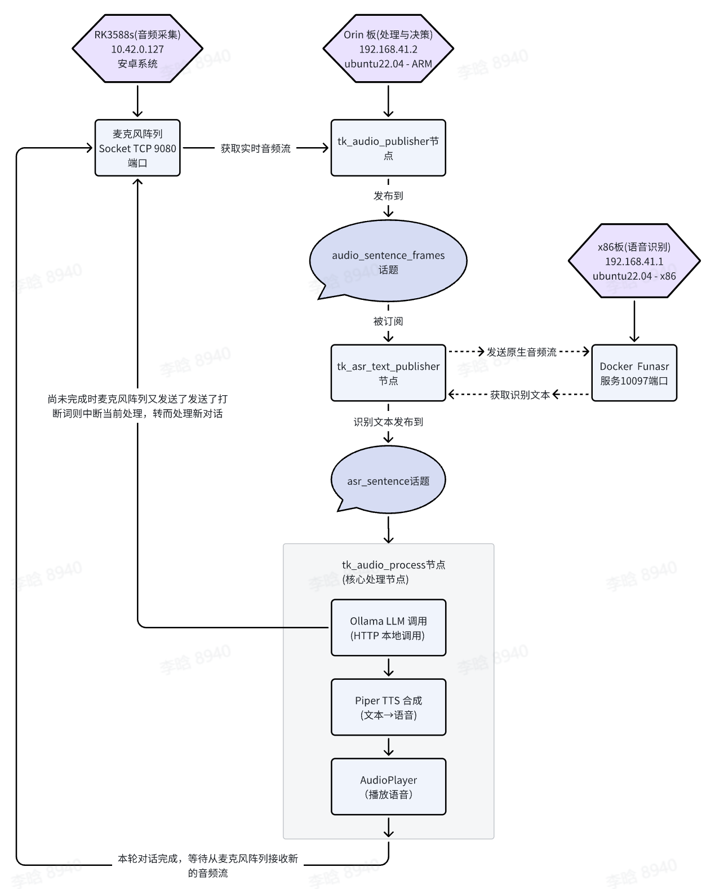

# TKVoice 项目详细讲解指南

## 目录
1. [项目概要](#项目概要)
2. [系统架构](#系统架构)
3. [核心概念](#核心概念)
4. [模块详解](#模块详解)
5. [实现细节](#实现细节)
6. [开发注意事项](#开发注意事项)
7. [常见问题](#常见问题)

---

## 项目概要

### 什么是 TKVoice？

**TKVoice** 是一个完整的**基于天工行者（无界/无疆）的离线语音交互系统**，集成了三大核心功能：

| 功能 | 简称 | 作用 | 比喻 |
|------|------|------|------|
| 自动语音识别 | ASR | 将**用户的语音**转换成**文本** | 将说话转为打字 |
| 大语言模型 | LLM | 理解文本，生成**回答文本** | 理解问题并思考 |
| 文本转语音 | TTS | 将**文本**转换成**机器语音** | 将文字转为语音 |

### 完整的语音对话流程

```
用户说话 
    ↓
[ASR] 语音识别 → 获得文本
    ↓
[LLM] 大语言模型 → 生成回答
    ↓
[TTS] 文本转语音 → 生成语音
    ↓
机器说话
```

### 为什么使用离线方案？

- ✅ **隐私保护** - 数据不上云，完全本地处理
- ✅ **低延迟** - 不受网络影响，实时交互
- ✅ **可靠性高** - 无网络依赖，无需云服务账号
- ✅ **成本低** - 一次部署，无需服务费
- ⚠️ **资源要求高** - 需要较强的计算能力

---

## 系统架构

### 硬件拓扑结构

项目使用**多机器协同**架构，**Orin 板是整个系统的核心编排者**：



### IP 地址配置

| 设备 | IP 地址 | 功能 | 端口 |
|------|---------|------|------|
| RK3588s | 10.42.0.127 | 音频采集与播放 | 9080 |
| **Orin 板** | **192.168.41.2** | **ROS 2 系统 + Ollama LLM + Piper TTS** | **11434** |
| x86 服务器 | 192.168.41.1 | Funasr ASR 服务 | 10097 |

### 网络通信协议详解

#### 1. RK3588s ↔ Orin 板（Socket TCP）

```
RK3588s 麦克风
    ↓
音频流 (16000 Hz, 16-bit PCM)
    ↓
Socket TCP 连接 (10.42.0.127:9080)
    ↓ (发送原始音频)
tk_audio_publisher (通过VAD字段判断并接收整句的音频)
    ↓
ROS audio_sentence_frames 话题
    ↓
tk_asr_text_publisher (订阅)
```
其中RK3588s板上9080端口提供的TCP数据包，下文会有详细的说明。

#### 2. Orin 板 ↔ x86 服务器（WebSocket）

```
tk_asr_text_publisher (Orin 板)
    ↓
WebSocket Client 连接
    ↓
192.168.41.1:10097 (x86 服务器 Funasr)
    ↓
发送整句音频
    ↓
Funasr 模型识别
    ↓
返回识别结果
    ↓
获得最终识别文本
```

#### 3. Orin 板内部（本地 Ollama + Piper TTS）

```
tk_audio_process (收到识别文本)
    ↓
Ollama LLM Client (HTTP)
    ↓
localhost:11434/api/chat (本地 Ollama 服务)
    ↓
qwen2.5:1.5b 模型流式生成回答
    ↓
等待流式返回适合作为一个分句播放的回答文本后
    ↓
Piper TTS (本地调用)
    ↓
ONNX 模型推理：文本→语音波形
    ↓
AudioPlayer 播放
    ↓
持续播放直到Ollama LLM Client生成结束
```

### 关键点总结

| 层级 | 处理位置 | 技术 | 说明 |
|------|---------|------|------|
| **音频采集** | RK3588s | 麦克风阵列 + Socket | 原始音频通过 Socket 发送到 Orin |
| **音频接收与发布** | Orin 板 | tk_audio_publisher (ROS) | 接收原始音频，按整句发布 |
| **语音识别** | Orin 板 发送，x86 处理 | WebSocket + Funasr Docker | Orin 通过 WebSocket 将音频发送给 x86 识别 |
| **文本发布** | Orin 板 | tk_asr_text_publisher (ROS) | 识别结果发布到 ROS 话题 |
| **LLM 处理** | Orin 板 | Ollama HTTP API | 本地调用 Ollama，生成回答（流式） |
| **TTS 合成** | Orin 板 | Piper ONNX + Pytorch | 本地调用 Piper，生成语音波形 |
| **音频播放** | Orin 板 | AudioPlayer (PyAudio) | 队列式播放，通过 Socket 返回给 RK3588s |

---

## 核心概念

### 1. ROS 2 中间件

TKVoice 是一个 **ROS 2** 项目，使用发布-订阅模式传递数据。

**ROS 的类比：**
- 想象多个独立的程序，需要通过"话题（Topic）"进行通信
- 一个程序"发布"数据，其他程序"订阅"数据
- 就像报纸一样：报社发行（发布），读者订阅阅读

**项目中的 ROS 话题：**

| 话题名 | 数据类型 | 发布者 | 订阅者 | 含义 |
|-------|--------|-------|-------|------|
| `audio_frames` | AudioFrame | tk_audio_publisher | 内部 | 单个音频帧 |
| `audio_sentence_frames` | AudioFrame | tk_audio_publisher | tk_asr_text_publisher | 整句音频 |
| `asr_sentence` | String | tk_asr_text_publisher | tk_audio_process | 识别文本 |

### 2. 线程与异步编程

TKVoice 大量使用**多线程**处理并发任务：

```python
import threading

# 创建一个在后台运行的线程
thread = threading.Thread(target=some_function, daemon=True)
thread.start()

# 线程会与主线程并行执行
```

**为什么需要多线程？**

在语音交互中，需要同时做多件事：
- 接收音频数据（I/O 密集）
- 发送数据到 ASR 服务（网络 I/O 密集）
- 处理 LLM 回答（计算密集）
- 播放语音（I/O 密集）

如果只用单线程，会造成阻塞：音频接收时无法处理回答。

### 3. 队列（Queue）数据结构

```python
from queue import Queue

q = Queue(maxsize=1)  # 最多保存1个元素

# 放入数据
q.put(data)

# 取出数据
data = q.get(timeout=2)  # 等待2秒，如果没有数据会超时
```

**队列的作用：**
- 在线程间安全地传递数据
- 实现生产者-消费者模式
- 自动处理线程同步

### 4. WebSocket 实时通信

WebSocket 是一种**双向实时通信协议**：

```
普通 HTTP (请求-响应):         WebSocket (持久连接):
客户端 → 服务器                 客户端 ↔ 服务器
  ↓                              ↓
获取响应 → 关闭连接        保持连接，随时收发数据
  ↓                              ↓
重复                            流式处理
```

**TKVoice 中的应用：**
- 与 Funasr 通信时，使用 WebSocket 发送音频块
- Funasr 边识别边返回结果（流式）

### 5. 音频处理基础

**采样率（Sample Rate）：** 16000 Hz = 每秒 16000 个样本点
**位深（Bit Depth）：** 16 bit = 每个样本 2 字节
**通道（Channels）：** 1 = 单声道

计算：1 秒音频大小 = 16000 × 2 = 32000 字节 ≈ 31 KB

---

## 模块详解

### 第一层：音频采集模块

#### 模块文件
- `socket_connector.py` - Socket 连接管理
- `socket_audio_provider.py` - 音频接收与解析
- `tk_audio_publisher.py` - 音频发布到 ROS

#### 数据流

```
RK3588s 麦克风阵列
    ↓
Socket 服务器 (IP: 10.42.0.127, Port: 9080)
    ↓
SocketConnector 建立连接
    ↓
SocketAudioProvider 接收原始数据
    ↓
SocketAudioPublisher 发布到 ROS 话题
```

#### 关键概念：VAD（语音活动检测）

当接收音频数据时，需要识别**什么时候是说话，什么时候是静音**：

```
VAD 状态码：
  0 = 静音
  1 = 开始说话（新的语句开始）
  2 = 持续说话
  3 = 结束说话（语句结束）
```

**实现逻辑：**

```python
def keep_receiving_publish_audio():
    while True:
        audio_data, vad = socket_provider.read()
        
        if vad == 1:  # 开始说话
            audio_buffer.clear()  # 清空旧数据
            audio_buffer.extend(audio_data)
        
        elif vad == 2:  # 持续说话
            audio_buffer.extend(audio_data)  # 继续追加
        
        elif vad == 3:  # 结束说话
            audio_buffer.extend(audio_data)
            # 整句音频已完成，发布到话题
            publish_sentence(audio_buffer)
            audio_buffer.clear()
```

#### 代码详解：SocketConnector

```python
class SocketConnector:
    def __init__(self, ip: str, port: int):
        # 创建 TCP Socket
        self.client_socket = socket(AF_INET, SOCK_STREAM)
        
        # 连接到服务器
        self.client_socket.connect((ip, port))
        
        # 设置接收超时 3 秒
        self.client_socket.settimeout(3.0)

    def receive_full_data(self, expected_length):
        """
        接收完整数据块
        
        由于 TCP 是流协议，可能分多次接收数据：
        比如要接收 1000 字节，可能第一次收到 500，第二次收到 500
        """
        received_data = bytearray()
        
        while len(received_data) < expected_length:
            # 一次最多接收 4096 字节
            chunk = self.client_socket.recv(4096)
            
            if not chunk:  # 服务器关闭连接
                return None
            
            received_data.extend(chunk)
        
        return bytes(received_data)
```

#### 代码详解：SocketAudioProvider
这是从RK3588s接收音频数据的详细代码，为何这样接收？天工行者搭载的是讯飞的RK3588 AIUI多模态开发套件，其音频传输协议地址是：https://aiui-doc.xf-yun.com/project-1/doc-392/，
其中明确说明了，0~8个字节是请求头，对应下面的 `header = self.receive_full_data(9)`，第9个字节是vad字段，也就是下面代码中的`vad = body[0]`，第17到n个字节就是详细的音频数据，对应下面代码中`audio_data = body[8:-1]`。

```python
class SocketAudioProvider(SocketConnector):
    def read(self):
        """解析音频包协议"""
        
        # 1. 接收 9 字节头部
        header = self.receive_full_data(9)
        # 格式: [同步字, 用户ID, 消息类型, 消息长度, 消息ID]
        # 二进制格式: 1字节 + 1字节 + 1字节 + 2字节 + 4字节
        
        sync_head, user_id, msg_type, msg_length, msg_id = struct.unpack(
            '<BBBIH',  # < 表示小端序，B=字节，I=整数，H=短整数
            header
        )
        
        # 2. 校验头部
        if sync_head != 0xa5 or user_id != 0x01:
            return None  # 无效包
        
        # 3. 接收消息体
        body = self.receive_full_data(msg_length + 1)
        # 格式: [VAD, 通道号, ...] + CRC校验字节
        
        vad = body[0]  # VAD 状态
        audio_data = body[8:-1]  # 提取音频数据
        
        return audio_data, vad
```

#### 代码详解：SocketAudioPublisher

```python
class SocketAudioPublisher(Node):
    def __init__(self):
        super().__init__('tk_audio_publisher')
        
        # 创建两个发布者
        self.publisher_ = self.create_publisher(
            AudioFrame,          # 消息类型
            'audio_frames',      # 话题名
            10                   # 队列大小
        )
        
        self.sentence_publisher_ = self.create_publisher(
            AudioFrame,
            'audio_sentence_frames',
            10
        )
        
        # 创建 Socket 提供者
        self.audio_provider = SocketAudioProvider('10.42.0.127', 9080)
        
        # 启动后台接收线程
        self.receive_pub_thread = threading.Thread(
            target=self.keep_receiving_publish_audio
        )
        self.receive_pub_thread.start()

    def keep_receiving_publish_audio(self):
        """后台线程：持续接收并发布音频"""
        audio_buffer = bytearray()
        
        while not self.stop_event.is_set():
            audio_res = self.audio_provider.read()
            
            if audio_res is None:
                continue
            
            audio_data, vad = audio_res
            
            if vad == 1:  # 开始说话
                audio_buffer.clear()
                audio_buffer.extend(audio_data)
                
            elif vad == 2:  # 持续说话
                audio_buffer.extend(audio_data)
                
            elif vad == 3:  # 结束说话
                audio_buffer.extend(audio_data)
                
                # 发布整句音频
                msg = AudioFrame()
                msg.data = bytes(audio_buffer)
                self.sentence_publisher_.publish(msg)
                
                self.get_logger().info(
                    f"发布了一句完整音频，长度: {len(audio_buffer)}"
                )
                
                audio_buffer.clear()
```

---

### 第二层：语音识别模块（ASR）

#### 模块文件
- `funasr_client.py` - Funasr WebSocket 客户端
- `tk_asr_text_publisher.py` - ASR 文本发布

#### 数据流

```
audio_sentence_frames 话题
    ↓
tk_asr_text_publisher 订阅
    ↓
funasr_client WebSocket 发送音频
    ↓
x86 Funasr 服务识别
    ↓
WebSocket 返回识别结果
    ↓
asr_sentence 话题发布
```

#### 核心概念：WebSocket 流式识别

```
// 1. 连接到 WebSocket 服务器
ws = websocket.connect("wss://192.168.41.1:10097")

// 2. 发送握手消息（告诉服务器识别参数）
ws.send({
    "mode": "offline",      // 离线模式
    "sample_rate": 16000,   // 采样率
    "chunk_size": [5,10,5]  // 每次发送的音频块大小
})

// 3. 分块发送音频（流式）
for chunk in audio_chunks:
    ws.send_binary(chunk)

// 4. 接收识别结果（也是流式）
for result in ws.recv():
    text = result["text"]
    print(f"识别结果: {text}")
```

#### 代码详解：FunASRClient

```python
class FunASRClient:
    def __init__(self, host="192.168.41.1", port=10097):
        self.host = host
        self.port = port
        self.ssl_enabled = True  # 使用 WSS 加密连接
        
        # 识别参数配置
        self.sample_rate = 16000
        self.chunk_size = [5, 10, 5]  # 音频块大小（毫秒）
        self.chunk_interval = 10      # 块间隔
        
        # WebSocket 连接（通过全局异步循环）
        self.loop = GlobalAsyncLoop.get_loop()
        self.connect()

    async def _connect(self):
        """建立 WebSocket 连接"""
        # 构造 WebSocket URI
        uri = f"wss://{self.host}:{self.port}"
        
        # SSL 上下文（关闭证书验证）
        ssl_context = ssl.SSLContext(ssl.PROTOCOL_TLS)
        ssl_context.check_hostname = False
        ssl_context.verify_mode = ssl.CERT_NONE
        
        # 连接
        return await websockets.connect(
            uri,
            subprotocols=["binary"],
            ping_interval=None,  # 禁用心跳
            ssl=ssl_context
        )

    def to_text(self, audio_bytes: bytes) -> str:
        """
        同步接口：输入音频字节，输出识别文本
        """
        # 在异步循环中执行异步函数
        future = asyncio.run_coroutine_threadsafe(
            self._async_to_text(audio_bytes),
            self.loop
        )
        
        return future.result(timeout=30)

    async def _async_to_text(self, audio_bytes: bytes) -> str:
        """异步识别实现"""
        ws = await self.try_init_connection()
        
        # 1. 发送握手消息
        start_signal = {
            "mode": "offline",
            "sample_rate": self.sample_rate,
            "chunk_size": self.chunk_size,
            "chunk_interval": self.chunk_interval,
        }
        await ws.send(json.dumps(start_signal))
        
        # 2. 分块发送音频
        chunk_bytes = (self.sample_rate / 1000) * 2  # 每毫秒字节数
        
        for i in range(0, len(audio_bytes), int(chunk_bytes * 10)):
            chunk = audio_bytes[i:i+int(chunk_bytes*10)]
            await ws.send(chunk)  # 发送二进制数据
            await asyncio.sleep(0.01)
        
        # 3. 发送结束信号
        await ws.send(json.dumps({"mode": "offline"}))
        
        # 4. 接收识别结果
        result_text = ""
        async for message in ws:
            data = json.loads(message)
            text = data.get("text", "")
            if text:
                result_text = text
            if data.get("done"):
                break
        
        return result_text
```

#### 代码详解：FunASRTextPublisher

```python
class FunASRTextPublisher(Node):
    def __init__(self):
        super().__init__('tk_asr_text_publisher')
        
        # 订阅音频话题
        self.subscription = self.create_subscription(
            AudioFrame,
            'audio_sentence_frames',
            self.audio_sentence_callback,
            10
        )
        
        # 创建发布者
        self.asr_sentence_publisher = self.create_publisher(
            String,
            '/asr_sentence',
            10
        )
        
        # 音频处理队列
        self.audio_queue = Queue(maxsize=1)
        
        # Funasr 客户端
        self.asr_service = FunASRClient(
            host="192.168.41.1",
            port=10097
        )
        
        # 后台处理线程
        self.process_thread = threading.Thread(
            target=self.keep_process_audio
        )
        self.process_thread.start()

    def audio_sentence_callback(self, msg: AudioFrame):
        """
        订阅回调：每当收到一句完整音频时调用
        """
        # 将音频放入队列
        self.audio_queue.put(msg)

    def keep_process_audio(self):
        """后台线程：处理音频并识别"""
        while True:
            try:
                # 从队列取出音频（最多等待 2 秒）
                msg = self.audio_queue.get(timeout=2)
                
                # 转换为字节
                audio_bytes = bytes(msg.data)
                
                self.get_logger().info(
                    f"接收到 {len(audio_bytes)} 字节音频，开始识别..."
                )
                
                # 调用 Funasr 识别
                asr_sentence = self.asr_service.to_text(audio_bytes)
                
                # 过滤过短的识别结果
                if len(asr_sentence) <= 3:
                    self.get_logger().info(f"忽略过短结果: {asr_sentence}")
                    continue
                
                # 发布识别结果
                text_msg = String()
                text_msg.data = asr_sentence
                self.asr_sentence_publisher.publish(text_msg)
                
                self.get_logger().info(f"发布识别结果: {asr_sentence}")
                
            except Empty:
                continue  # 超时继续等待
            except Exception as e:
                self.get_logger().error(f"识别出错: {e}")
```

---

### 第三层：自然语言理解模块（LLM）

#### 模块文件
- `llm_client.py` - Ollama LLM 客户端

#### 数据流

```
asr_sentence 话题
    ↓
llm_client 接收文本
    ↓
HTTP API 发送提问到 Ollama
    ↓
Ollama qwen2.5:1.5b 模型推理
    ↓
流式返回回答文本
    ↓
answer_text_queue 放入文本
```

#### 核心概念：流式生成

LLM 不是一次性返回完整回答，而是**流式返回**，一个词一个词生成：

```
提问：你好吗？
     ↓ (等待中...)
回答：我是... (第1秒)
回答：我是一个... (第2秒)
回答：我是一个AI... (第3秒)
...
```

优点：用户可以更快听到回答的开始部分。

#### 代码详解：LLMClient

```python
class LLMClient:
    def __init__(self, max_history=1):
        self.max_history = max_history
        self.history = deque(maxlen=max_history * 2)
        self.system_message = None
        # 测试并确定 LLM 服务运行的实际 IP
        self.active_llm_ip = self.test_llm_ip()

        self.api_key = os.environ.get("LLM_KEY", "ollama")
        self.llm_endpoint = f'http://{self.active_llm_ip}:11434/v1/' if self.active_llm_ip else None
        self.llm_model = os.environ.get("LLM_MODEL", "qwen2.5:1.5b")
        self.sys_message = os.environ.get("SYS_MESSAGE", '你是优必选开发的智能助手，名叫天工形者。回答简洁明了，尽量100个字以内，用中文回答。')

        # 句子切分配置
        self.sentence_endings = "。！？.!?"
        self.soft_endings = "，、;；,"
        self.max_len = 25

        self.mp_context = multiprocessing.get_context("spawn")
        # 控制字段
        self.process = None
        self.queue = None

        self.set_system_message(self.sys_message)
        self.load_model()

    def test_llm_ip(self, timeout=2):
        """
        测试 Ollama 服务运行在哪个 IP 上。
        备选 IP: 192.168.41.3 和 192.168.41.2
        使用 /api/version 接口验证服务可用性。
        返回可用的 IP，若都不可达则返回 None。
        """
        candidate_ips = ["192.168.41.3", "192.168.41.2"]
        ollama_port = 11434

        for ip in candidate_ips:
            url = f"http://{ip}:{ollama_port}/api/version"
            try:
                logging.info(f"[LLM] 测试 Ollama 服务: {url}")
                req = urllib.request.Request(url, method='GET')
                with urllib.request.urlopen(req, timeout=timeout) as response:
                    if response.status == 200:
                        import json
                        version_info = json.loads(response.read().decode('utf-8'))
                        logging.info(f"[LLM] 发现 Ollama 服务运行在 {ip}, 版本: {version_info.get('version', 'unknown')}")
                        return ip
            except (urllib.error.URLError, urllib.error.HTTPError, TimeoutError) as e:
                logging.debug(f"[LLM] {ip} 不可达: {e}")
                continue

        logging.warning("[LLM] 未找到可用的 Ollama 服务 (192.168.41.3, 192.168.41.2)")
        return None

    def set_system_message(self, content):
        self.system_message = {"role": "system", "content": content}

    def add_message(self, role, content):
        self.history.append({"role": role, "content": content})

    def get_messages_payload(self, user_input):
        messages = []
        if self.system_message:
            messages.append(self.system_message)
        messages.extend(list(self.history))
        messages.append({"role": "user", "content": user_input})
        return messages

    def load_model(self, model_name=None):
        return

    @staticmethod
    def _stream_worker(base_url, model, messages_payload, queue, api_key):
        """
        子进程执行 HTTP 请求，将 text 内容直接放入队列。
        主进程再负责拼接句子和分段逻辑。
        """
        try:
            logging.info(f'[子进程] 开始请求 {base_url}')
            with OpenAI(api_key=api_key, base_url=base_url) as client:
                completion = client.chat.completions.create(
                    model=model,
                    messages=messages_payload,
                    stream=True,
                    stream_options={"include_usage": True}
                )
                logging.info(f'[子进程] 请求已发起，等待输出')
                for chunk in completion:
                    if chunk.choices:
                        content = chunk.choices[0].delta.content or ""
                        queue.put(content)
                    elif chunk.usage:
                        logging.debug(f"[子进程] 总计 Tokens: {chunk.usage.total_tokens}")

        except Exception as e:
            logging.info(f'[子进程] 出错: {e}', exc_info=True)
        finally:
            queue.put(None)  # 表示结束
            logging.debug("[子进程] 数据发送完成，等待主进程处理。")

```

#### 句子切分逻辑

由于 TTS 生成语音需要时间，项目使用**句子切分**来提前生成语音：

```python
while True:
    try:
        chunk = q.get(timeout=0.5)
        if chunk is None:
            logging.debug("[NLP] Received None from queue, stream complete")
            break  # 子进程结束
        assistant_response += chunk
        buffer += chunk

        # 用句号断句
        while any(punc in buffer for punc in self.sentence_endings):
            idx = min(
                [buffer.find(punc) for punc in self.sentence_endings if punc in buffer]
            )
            sentence = buffer[: idx + 1].strip()
            logging.info(f"[NLP] Stream output sentence: {sentence}")
            yield sentence
            buffer = buffer[idx + 1:]

        # 已出现太多文字还没出现句号，则软分割（超过 max_len）
        if len(buffer) >= self.max_len:
            for punc in self.soft_endings:
                if punc in buffer:
                    idx = buffer.find(punc)
                    sentence = buffer[: idx + 1].strip()
                    logging.info(f"[NLP] Stream output sentence (soft split): {sentence}")
                    yield sentence
                    buffer = buffer[idx + 1:]
                    break

    except queue.Empty:
        if not p.is_alive():
            logging.debug("[NLP] Subprocess ended, stream output complete")
            break
        continue
    except KeyboardInterrupt:
        logging.info("[NLP] Caught KeyboardInterrupt, terminating subprocess")
        self.set_interrupted(True)
        break
```

---

### 第四层：文本转语音模块（TTS）

#### 模块文件
- `piper_provider.py` - Piper TTS 语音合成

#### 数据流

```
answer_text_queue 中的文本
    ↓
piper_provider.tts() 合成语音
    ↓
音频字节 (float32 格式)
    ↓
AudioPlayer.play() 播放
```

#### 核心概念：ONNX 模型推理

Piper 使用 **ONNX** 格式的模型（轻量级，跨平台）：

```
ONNX 模型 (.onnx 文件)
    ↓
ONNX Runtime 加载
    ↓
CPU/GPU 推理
    ↓
语音波形
```

#### 代码详解：PiperProvider

```python
class PiperProvider:
    def __init__(self):
        # 模型路径
        MODEL_DIR = os.environ.get("MODEL_DIR", "/home/nvidia/")
        self.model_path = os.path.join(
            MODEL_DIR,
            "piper_voices/zh/zh_CN-huayan-medium.onnx"
        )
        self.tts_config_path = self.model_path + ".json"
        
        # 合成参数配置
        self.piper_syn_config = SynthesisConfig(
            length_scale=1.1,       # 语速：1.0=正常，<1.0=快，>1.0=慢
            noise_scale=0.4,         # 音素噪声：低=清晰，高=自然
            noise_w_scale=0.5,       # 语调波动：低=平坦，高=自然
            normalize_audio=True,    # 自动归一化音量
            volume=1.0               # 输出音量
        )
        
        # 加载 ONNX 模型
        self.piper_instance = PiperVoice.load(
            self.model_path,
            config_path=self.tts_config_path,
            use_cuda=True  # 使用 GPU 加速
        )
        
        self.sample_rate = 21000  # 输出采样率

    def tts(self, text: str) -> bytes:
        """
        使用 piper 的 synthesize() 获取音频数据（16-bit PCM），直接可播放。
        """
        try:
            chunks = self.piper_instance.synthesize(text, syn_config=self.piper_syn_config)
            audio_bytes_list = [chunk.audio_int16_bytes for chunk in chunks]

            if not audio_bytes_list:
                return b''

            return b''.join(audio_bytes_list)
        except Exception as e:
            testpint(f"[TTS] 生成音频失败: {e}")
            return b''

    def play(self, waveform: bytes):
        """直接播放语音"""
        self.audio_stream.write(waveform)
```

#### 参数详解

| 参数 | 说明 | 范围 | 例子 |
|------|------|------|------|
| `length_scale` | 语速 | 0.5~2.0 | 1.1=稍微慢一点 |
| `noise_scale` | 音素噪声 | 0.0~2.0 | 0.4=清晰 |
| `noise_w_scale` | 语调波动 | 0.0~2.0 | 0.5=平和 |
| `normalize_audio` | 自动音量 | True/False | True=保持一致 |
| `volume` | 输出音量 | 0.0~2.0 | 1.0=原始 |

---

### 第五层：音频播放模块

#### 模块文件
- `utils.py` - AudioPlayer 类

#### 核心概念：多队列播放架构

TKVoice 支持**一个问题多个句子**的情况，每个句子有独立队列：

```
问题 1
  ├─ 句子 1A → 队列 1A → 播放
  ├─ 句子 1B → 队列 1B → 等待
  └─ 句子 1C → 队列 1C → 等待

新问题到来 → 清除所有旧队列，保留新问题队列
```

#### 代码详解：AudioPlayer

```python
class AudioPlayer:
    def __init__(self,
                 sample_rate: int = 21000,
                 channels: int = 1,
                 sample_width: int = 2,
                 audio_format: int = None,
                 frames_per_buffer: int = 1024):
        """
        Initialize AudioPlayer with configurable PCM audio format parameters.

        Args:
            sample_rate: Audio sample rate in Hz (default: 21000, matches piper-tts)
            channels: Number of audio channels, 1=mono, 2=stereo (default: 1)
            sample_width: Sample width in bytes, 1=8bit, 2=16bit, 4=32bit (default: 2 for 16-bit PCM)
            audio_format: PyAudio format constant (e.g., pyaudio.paInt16, pyaudio.paFloat32).
                          If None, inferred from sample_width.
            frames_per_buffer: Buffer size in frames (default: 1024)
        """
        # 先等待麦克风准备就绪，因为orin上直接连接有可能报错
        wait_for_audio_ready()
        self.audio = pyaudio.PyAudio()
        self.device_info = self.audio.get_default_output_device_info()
        self.audioid_lock = threading.Lock()
        self.audio_queues_map_lock = threading.Lock()
        self.audioid = ""
        self.audio_queues_map = {}

        # PCM audio format parameters
        self.sample_rate = sample_rate
        self.channels = channels
        self.sample_width = sample_width
        self.frames_per_buffer = frames_per_buffer

        # Map sample width/format to PyAudio format
        self.format = self._get_pyaudio_format(sample_width, audio_format)

        self.stream_lock = threading.Lock()
        self.playing_stream = self.open_stream()

        self.stop_event = threading.Event()
        self.playback_state_lock = threading.Lock()
        self.playback_deadline = 0.0
        self.output_latency_seconds = self._get_output_latency_seconds()

        self.playing_thread = threading.Thread(target=self.keep_playing_audio, daemon=True)
        self.playing_thread.start()
        logging.info(f"音频播放线程已启用 - 采样率:{self.sample_rate}Hz, 声道:{self.channels}, 位深:{self.sample_width*8}bit")

    def is_speaking(self) -> bool:
        """Check if audio is currently playing or has pending chunks to play."""
        # 1. Check if there's pending audio in the queue
        current_audioid = self.get_audioid()
        if self._has_pending_audio(current_audioid):
            return True

        # 2. Check if audio is still being played from hardware buffer
        with self.playback_state_lock:
            return time.monotonic() < self.playback_deadline
    
    def set_audioid(self, text: str):
        with self.audioid_lock:
            self.audioid = text
        with self.audio_queues_map_lock:
            self.audio_queues_map[text] = Queue()

    def get_audioid(self) -> str:
        with self.audioid_lock:
            return self.audioid
        
    def _get_pyaudio_format(self, sample_width: int, audio_format: int = None):
        """
        Convert sample width (in bytes) to PyAudio format.

        Args:
            sample_width: Sample width in bytes (1, 2, 3, or 4)
            audio_format: Optional PyAudio format constant. If provided, use directly.
                          If None, inferred from sample_width.

        Returns:
            PyAudio format constant
        """
        if audio_format is not None:
            return audio_format

        format_map = {
            1: pyaudio.paInt8,    # 8-bit
            2: pyaudio.paInt16,   # 16-bit
            3: pyaudio.paInt24,   # 24-bit
            4: pyaudio.paFloat32, # 32-bit float
        }
        if sample_width not in format_map:
            logging.warning(f"Unsupported sample width {sample_width}, using 16-bit default")
            return pyaudio.paInt16
        return format_map[sample_width]
    
    def _get_output_latency_seconds(self) -> float:
        try:
            latency = self.playing_stream.get_output_latency()
            if latency is None:
                return 0.0
            return max(0.0, float(latency))
        except Exception:
            return 0.0

    def _has_pending_audio(self, audioid: str) -> bool:
        """Check if there are pending audio chunks for the given audioid."""
        if not audioid:
            return False
        with self.audio_queues_map_lock:
            queue = self.audio_queues_map.get(audioid)
            if queue is None:
                return False
            return not queue.empty()

    def _mark_audio_playing(self, audio_data: bytes):
        bytes_per_second = self.sample_rate * self.channels * self.sample_width
        if bytes_per_second <= 0:
            return

        chunk_duration = len(audio_data) / bytes_per_second
        with self.playback_state_lock:
            # 如果当前没有在播放，从当前时间开始
            # 如果正在播放，从上一个截止时间继续累加
            start_time = max(time.monotonic(), self.playback_deadline)
            self.playback_deadline = start_time + chunk_duration + self.output_latency_seconds
        
    def open_stream(self):
        with self.stream_lock:
            last_exc = None
            for _ in range(3):
                try:
                    device_index = self.device_info['index']
                    logging.info(f'使用的音频输出设备索引: {device_index}, 设备名称: {self.device_info["name"]}')
                    stream = self.audio.open(
                        format=self.format,
                        rate=self.sample_rate,
                        channels=self.channels,
                        output=True,
                        output_device_index=device_index,
                        frames_per_buffer=self.frames_per_buffer
                    )
                    return stream
                except OSError as e:
                    logging.info(f'PyAudio open_stream报错了：{e}')
                    traceback.print_exc()
                    if e.errno == -9997:  # Invalid sample rate
                        last_exc = e
                        time.sleep(3)  # 等待一会再试
                    else:
                        raise  # 不是采样率的问题，直接抛出
            # 三次都失败，抛出最后一次的异常
        raise last_exc
    
    def stop_other_audio_and_clear_queue(self):
        audioid = self.get_audioid()
        with self.audio_queues_map_lock:
            for q_text in list(self.audio_queues_map.keys()):
                if q_text == audioid:
                    continue
                try:
                    del self.audio_queues_map[q_text]
                except KeyError:
                    pass

    def close(self):
        self.stop_event.set()
        self.playing_thread.join(timeout=2)
        with self.playback_state_lock:
            self.playback_deadline = 0.0

        with self.stream_lock:
            self.playing_stream.stop_stream()
            self.playing_stream.close()

        self.audio.terminate()

    def try_put(self, audioid: str, audio_data: bytes):
        if audioid not in self.audio_queues_map:
            with self.audio_queues_map_lock:
                if audioid not in self.audio_queues_map:
                    self.audio_queues_map[audioid] = Queue()
        queue = self.audio_queues_map[audioid]
        try:
            queue.put(audio_data, timeout=1)
        except Full:
            queue.get_nowait()  # 弹出最旧的一条
            queue.put(audio_data)

    def play(self, audio_data: bytes):
        self.try_put(self.get_audioid(), audio_data)

    def keep_playing_audio(self):
        while not self.stop_event.is_set():            
            if not self.playing_stream.is_active():
                self.playing_stream.start_stream()
                continue
            queue = None
            try:
                q_text = self.get_audioid()
                if q_text not in self.audio_queues_map:
                    time.sleep(0.01)
                    continue
                queue = self.audio_queues_map.get(q_text)
                if queue is None:
                    time.sleep(0.01)
                    continue
                audio_data = queue.get_nowait()
            except Empty:
                time.sleep(0.01)
                continue

            try:
                if audio_data is None:
                    time.sleep(0.01)
                    break
                self._mark_audio_playing(audio_data)
                with self.stream_lock:
                    self.playing_stream.write(audio_data)

            except Exception as e:
                logging.info(f"播放音频时发生错误: {e}")

```

---

### 第六层：完整处理流程

#### 模块文件
- `tk_audio_process.py` - 核心编排节点

#### 完整数据流

```
asr_sentence 话题 (识别文本)
    ↓
[on_asr_sentence] 接收
    ↓
[keep_question_to_answer_by_ollama] 线程
    ├─ 调用 Ollama LLM
    ├─ 流式获取回答
    └─ 放入 answer_text_queue
    ↓
[keep_answer_to_audio_and_play] 线程
    ├─ 从队列取文本
    ├─ 调用 Piper TTS 生成语音
    └─ 调用 AudioPlayer.play() 播放
```

---

## 实现细节

### 多线程同步机制

#### 1. Lock（锁）

```python
import threading

lock = threading.Lock()

# 在多线程修改共享变量时使用
with lock:
    shared_variable = new_value  # 安全操作
```

#### 2. Queue（队列）

```python
from queue import Queue

q = Queue(maxsize=1)  # 线程安全的队列

# 生产者线程
q.put(data)

# 消费者线程
data = q.get(timeout=1)  # 1秒超时
```

#### 3. Event（事件）

```python
import threading

event = threading.Event()

# 线程 1：等待事件
event.wait()  # 阻塞直到事件被设置

# 线程 2：设置事件
event.set()

# 清除事件
event.clear()
```

### 异常处理模式

```python
try:
    # 可能出错的代码
    result = network_call()
except Timeout:
    # 网络超时
    logging.error("请求超时")
except ConnectionError:
    # 连接错误
    logging.error("连接失败")
except Exception as e:
    # 其他所有异常
    logging.error(f"未知错误: {e}")
    traceback.print_exc()  # 打印堆栈
finally:
    # 无论是否异常，都会执行
    cleanup_resources()
```

### 流式处理模式

```python
# 生成器：一个一个产生数据，不一次性加载全部
def stream_data():
    for chunk in data_chunks:
        yield chunk

# 使用生成器
for chunk in stream_data():
    process(chunk)  # 立即处理，无需等待全部数据
```

---

## 开发注意事项

### 1. 常见问题排查

| 问题 | 原因 | 解决 |
|------|------|------|
| 无法连接 x86 | IP 地址或端口错误 | 检查 192.168.41.1:10097 是否可访问 |
| ASR 识别为空 | 音频太小或无效 | 增加麦克风音量，检查 VAD 状态 |
| LLM 无响应 | Ollama 未启动 | `ollama serve` 启动 Ollama |
| TTS 无声音 | PyAudio 设备错误 | 检查音频输出设备，运行 `python -c "import pyaudio; print(pyaudio.PyAudio().get_default_output_device_info())"` |

---

## 常见问题

### Q1: 如何修改唤醒词？

**A:** 在 `tk_audio_process.py` 中修改：

```python
self.wake_up_words = ["天工", "天空", "天宫"]  # 改成你的唤醒词
```

### Q2: 如何增加语音响应速度？

**A:** 减小 LLM 模型或使用更快的模型：

```python
# 在 llm_client.py 中
self.model = "qwen2.5:0.5b"  # 改为更小的模型，但是生成回答的逻辑性会有待验证
```

### Q3: 如何调整 TTS 语速？

**A:** 在 `piper_provider.py` 中调整：

```python
self.piper_syn_config = SynthesisConfig(
    length_scale=0.8,  # < 1.0 更快，> 1.0 更慢
    ...
)
```

### Q4: 支持多语言吗？

**A:** 需要下载对应语言的 Piper 模型：

```bash
# 下载对应的语种语音模型
https://huggingface.co/rhasspy/piper-voices/tree/main
```

然后在 `piper_provider.py` 中修改模型路径。

**B:** x86上的Funasr也需要重新部署支持英文的模型，参考：
https://github.com/modelscope/FunASR


### Q5: 如何实现多轮对话记忆？

**A:** 调整 `llm_client.py` 中的历史记录长度：

```python
self.history = deque(maxlen=10)  # 保存最近 5 轮（10 条消息）
```

### Q6: 可以离线使用其他 Ollama 模型吗？

**A:** 可以，但 Ollama 模型需要提前下载：

```bash
ollama pull qwen2.5:1.5b
```
然后修改调用 llm_client 的调用，指定对应的模型。

### Q7: 调用 funasr_client 进行语音识别时报错？

到x86机器上检查funasr服务对应的docker容器是否启动：
```bash
docker ps|grep asr
```

### Q8: 如何处理网络不稳定？

**A:** 增加重试机制：

```python
for attempt in range(3):
    try:
        result = self.asr_service.to_text(audio_bytes)
        return result
    except Exception as e:
        if attempt < 2:
            time.sleep(2 ** attempt)  # 指数退避
        else:
            raise
```

---

