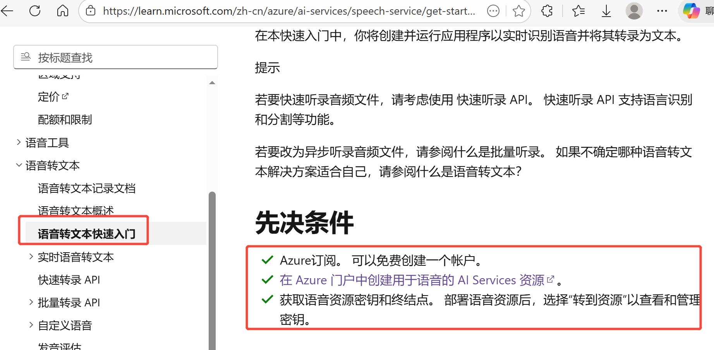

For English, refer to [readme_en.md](./readme_en.md)

# 前言
整个项目包含ASR能力（使用的微软Azure Speech Service），大语言模型（仅支持可OpenAI SDK调用的LLM服务），TTS能力（使用的微软Azure Speech Service）。

## 一、代码说明

整个应用的运行流程是：
1. Orin板上 tk_audio_publisher 节点从RK3588s获取音频流，按整句的音频流发布到 audio_sentence_frames 话题；

2. Orin板上的节点 tk_asr_text_publisher 订阅 audio_sentence_frames 话题，获取到原生音频流后通过 Azure Speech Service 的 azure.cognitiveservices.speech SDK 内的 SpeechRecognizer 相关类和方法 发送给 Azure Speech Service，并获取到语音识别后的文本，将其发布到 asr_sentence 话题；

3. Orin板上的节点 tk_audio_process 订阅 asr_sentence 话题，获取到提问文本后，使用 openai SDK 将提问发送到配置的 LLM 服务，流式获取回答，具体的 LLM 服务在项目根目录下的 .env 文件内配置。请注意，目前代码内只使用了 openai SDK 发起请求获取回答，所以目前只能配置兼容 openai SDK 的 LLM 服务。

4. 在 LLM 流式输出回答的过程中，每接收到足够组成一个句子的字符后，就调用 azure.cognitiveservices.speech SDK 内的 SpeechSynthesizer 相关类和方法，将句子文本转为对应的语音，然后将语音放入 AudioPlayer 的播放队列，按顺序播放。

5. 根目录下的 .env 文件，内容说明（这个文件很重要，配置好这个文件是整个项目中 ASR, LLM, TTS 可用的前提）：
    ### LLM配置项
    ```bash
    LLM_KEY=sk-xxx
    LLM_ENDPOINT=https://dashscope.aliyuncs.com/compatible-mode/v1
    LLM_MODEL=qwen-flash
    ```

    所有兼容 openai SDK 的 LLM 服务提供商都会提供上述3个参数
    - LLM_KEY 也有可能叫 API Key （例如阿里云百炼平台），不同的服务商的叫法可能不一样。
    - LLM_ENDPOINT 也有可能叫 Base URL（例如阿里云百炼平台），也就是该 LLM 服务要使用的节点。
      
      以阿里云百炼平台为例，节点选择和密钥获取可参考[【百炼平台官方文档】](https://modelstudio.console.aliyun.com/us-east-1?tab=doc#/doc/?type=model&url=3004398)，如下图，有可选择的节点以及对应的密钥管理的链接。
      
      
      其他例如微软，亚马逊或者openai等，应该有全球节点可供选择。
    - LLM_MODEL 也就是要选择的模型名称，以阿里云百炼平台为例，可选用的有 qwen3-max, qwen-plus, qwen-flash 等，参考: https://help.aliyun.com/zh/model-studio/models 。对于微软，亚马逊或者openai等，应该也有其他的模型可选，需要用户自行探索。
    - 若考虑使用微软 LLM ，参考: https://learn.microsoft.com/en-us/azure/ai-foundry/openai/supported-languages?tabs=dotnet-secure%2Csecure%2Cpython-entra&pivots=programming-language-python

    ### Azure Speech Service Key 和节点
    ```bash
    SPEECH_KEY="xxx"
    STT_ENDPOINT=https://eastasia.stt.speech.microsoft.com
    TTS_ENDPOINT=https://eastasia.tts.speech.microsoft.com
    ```
    ASR 和 TTS 目前是对接的 Azure 的语音服务，需要如下参数：
    - SPEECH_KEY 也就是调用服务所需要的 key
    - STT_ENDPOINT 语音转文本节点
    - TTS_ENDPOINT 文本转语音节点
    
    详细步骤可参考[【微软语音服务官方文档】](https://learn.microsoft.com/zh-cn/azure/ai-services/speech-service/get-started-speech-to-text?pivots=programming-language-python)
    

    创建好资源后，后续可在[【Azure主页】](https://portal.azure.com/#home)查看所需要的内容：
    

    密钥即为 `SPEECH_KEY` ，右边有复制按钮。

    AI服务下可看到stt和tts的节点，注意域名第一节 `eastus` 为地理编号，详细可查看[【官方文档】](https://learn.microsoft.com/zh-cn/azure/ai-services/speech-service/regions?tabs=geographies#regions)


    ### 识别语言
    ```bash
    LANGUAGE=zh-CN
    ```

    该参数为微软语音识别服务识别的语种，可选值参考[【官方文档】](https://learn.microsoft.com/zh-cn/azure/ai-services/speech-service/language-support?tabs=stt)。

    ### 合成语言
    ```bash
    VOICE_NAME=sl-SI-RokNeural
    ```
    该参数为语音合成的语种，可选值参考[【官方文档】](https://learn.microsoft.com/zh-cn/azure/ai-services/speech-service/language-support?tabs=tts#multilingual-voices)，Azure的文档并不完全正确，并不是这里列出的所有音色都被支持。

    ### 系统提示词
    ```bash
    SYS_MESSAGE="你是优必选开发的智能助手，名叫天工形者。回答简洁明了，尽量100个单词以内，用斯洛文尼亚语回答。"
    ```
    该参数为本项目内使用的，设置的是 LLM 的系统内容。

    ### 打断词
    ```bash
    INTERRUPT_WORDS="天工,天空,天宫"
    ```
    打断词的意思是，当天工正在播放的时候，也是在收音的，收到的声音经 ASR 识别后如果检测到文本内包含打断词，即停止播放并进入收音状态，等用户提问，而如果不包含打断词，则这句提问会被忽略。打断词可配置多个，用英文的逗号分隔。

## 二、开发运行
先登录到 41.2 的 Orin 板

1. clone:
```bash
cd ~ && git clone https://github.com/UBTEDU-OPEN/tkvoice.git
```

2. 安装依赖，编译：
```bash
cd tkvoice
pip install azure-cognitiveservices-speech==1.47.0 openai==2.7.1
rm -rf build install log && colcon build --packages-select audio_message audio_service
```

3. 环境变量：
```bash
source install/setup.bash
```

4. 通过launch文件启动应用：
```bash
ros2 launch audio_service asr_llm_tts_process_launch.py
```

5. 对话

    天工所搭载的3588s上的麦克风阵列，收音是有方向性的，大约是麦克风阵列前方一个60度角的圆锥空间区域内，对话的时候需要让音源在这个空间内（也就是说话的人要在这个空间范围内），要不然麦克风阵列收不到音。
    
    天工在说话的过程中，可以被“天工天工”的声音打断，其他声音不会打断天工正在说的话。打断词可以在项目根目录下的 .env 文件内配置。


# 测试运行
先登录到 41.2 的 Orin 板，进入目录：
```bash
cd ~/tkvoice

然后可用如下命令进行管理:
# 启动服务
./tkvoice.sh start

# 停止服务
./tkvoice.sh stop

# 重启服务
./tkvoice.sh restart

# 查看状态
./tkvoice.sh status

# 查看日志"
tail -f /home/nvidia/tkvoice/tkvoice.log

```
