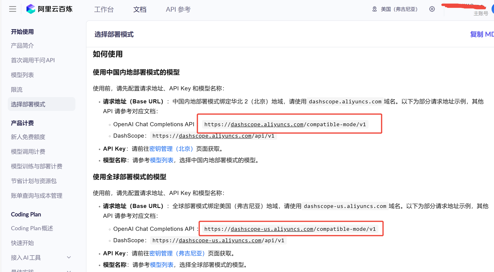
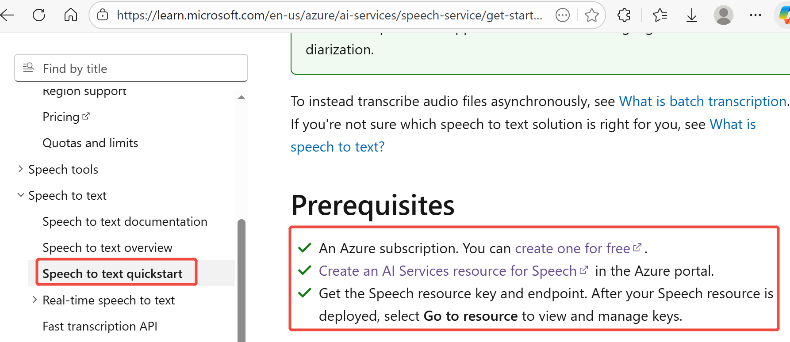
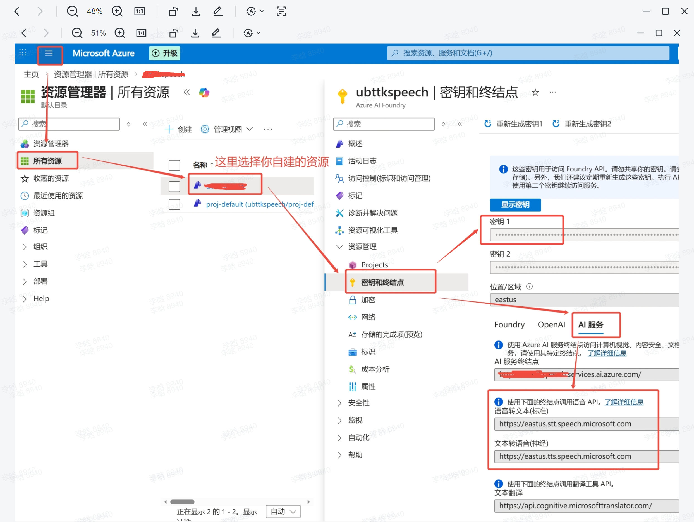

# Preface
The entire project includes the following capabilities:

STT (Speech to text) — powered by Microsoft Azure Speech Service.

Large Language Model (LLM) — supports only LLM services that can be accessed through the OpenAI SDK.

TTS (Text-to-Speech) — powered by Microsoft Azure Speech Service.

## 1. Code Description

The overall workflow of the application is as follows:
1. On the Orin board, the tk_audio_publisher node receives an audio stream from the RK3588s device and publishes complete sentence-level audio streams to the audio_sentence_frames topic.

2. On the Orin board, the tk_asr_text_publisher node subscribes to the audio_sentence_frames topic. After receiving the raw audio stream, it sends the data to Azure Speech Service using the SpeechRecognizer classes and methods from the azure.cognitiveservices.speech SDK. The recognized text is then published to the asr_sentence topic.

3. The tk_audio_process node on the Orin board subscribes to the asr_sentence topic. After receiving the recognized question text, it sends the query to the configured LLM service using the OpenAI SDK, retrieving the response in a streaming manner. The specific LLM service is configured in the .env file located in the project’s root directory.
    
    Note: The current implementation only uses the OpenAI SDK for requests, so only LLM services compatible with the OpenAI SDK are supported at this stage.

4. During the streaming output of the LLM’s response, whenever enough characters are received to form a complete sentence, the SpeechSynthesizer classes and methods from the azure.cognitiveservices.speech SDK are invoked to convert that sentence into speech. The generated audio is then added to the AudioPlayer playback queue and played sequentially.

5. The .env file located in the project’s root directory contains critical configuration parameters. Properly setting up this file is essential for enabling the STT, LLM, and TTS functionalities throughout the entire project. You may create this file if the file does not exist.
    ### LLM Configuration
    ```bash
    LLM_KEY=sk-xxx
    LLM_ENDPOINT=https://dashscope.aliyuncs.com/compatible-mode/v1
    LLM_MODEL=qwen-flash
    ```

    All LLM service providers compatible with the OpenAI SDK will provide the above 3 parameters:
    - `LLM_KEY` may also be called "API Key" (e.g., on Alibaba Cloud Bailian Platform). Different providers may use different terminology.
    - `LLM_ENDPOINT` may also be called "Base URL" (e.g., on Alibaba Cloud Bailian Platform). This is the endpoint for the LLM service you want to use.

      Taking Alibaba Cloud Bailian Platform as an example, you can refer to the [Bailian Platform Official Documentation](https://modelstudio.console.aliyun.com/us-east-1?tab=doc#/doc/?type=model&url=3004398) for node selection and key retrieval. As shown in the image below, you can find available nodes and the link to key management.
      

      Other providers such as Microsoft, Amazon, or OpenAI should also have global nodes available for selection.
    - `LLM_MODEL` is the name of the model to use. Taking Alibaba Cloud Bailian Platform as an example, available options include qwen3-max, qwen-plus, qwen-flash, etc. Refer to: https://help.aliyun.com/zh/model-studio/models. For Microsoft, Amazon, or OpenAI, there should be other models available as well—users need to explore these on their own.
    - For Microsoft LLM options, refer to: https://learn.microsoft.com/en-us/azure/ai-foundry/openai/supported-languages?tabs=dotnet-secure%2Csecure%2Cpython-entra&pivots=programming-language-python

    ### Azure Speech Service Key and Endpoints
    ```bash
    SPEECH_KEY="xxx"
    STT_ENDPOINT=https://eastasia.stt.speech.microsoft.com
    TTS_ENDPOINT=https://eastasia.tts.speech.microsoft.com
    ```
    STT and TTS currently integrate with Azure Speech Services and require the following parameters:
    - `SPEECH_KEY`: The key required to call the service
    - `STT_ENDPOINT`: Speech-to-text endpoint
    - `TTS_ENDPOINT`: Text-to-speech endpoint

    For detailed steps, refer to the [Microsoft Speech Service Official Documentation](https://learn.microsoft.com/en-us/azure/ai-services/speech-service/get-started-speech-to-text?pivots=programming-language-python)
    

    After creating the resource, you can view the required information on the [Azure Portal](https://portal.azure.com/#home):
    

    The "Key" is your `SPEECH_KEY` — use the copy button on the right.

    Under "AI Services" you can find the STT and TTS endpoints. Note that the first part of the domain (e.g., `eastus`) is the region identifier. For details, refer to the [Official Documentation](https://learn.microsoft.com/en-us/azure/ai-services/speech-service/regions?tabs=geographies#regions).


    ### Recognition Language
    ```bash
    LANGUAGE=zh-CN
    ```

    This parameter specifies the language for Microsoft STT recognition. For available values, refer to the [Official Documentation](https://learn.microsoft.com/zh-cn/azure/ai-services/speech-service/language-support?tabs=stt).

    ### Synthesis Voice
    ```bash
    VOICE_NAME=sl-SI-RokNeural
    # VOICE_NAME=it-IT-AlessioMultilingualNeural
    # VOICE_NAME=ko-KR-HyunsuMultilingualNeural
    # VOICE_NAME=ja-JP-MasaruMultilingualNeural
    # VOICE_NAME=zh-CN-Xiaoxiao:DragonHDFlashLatestNeural
    # VOICE_NAME=en-US-AvaMultilingualNeural
    # VOICE_NAME=de-DE-SeraphinaMultilingualNeural
    # VOICE_NAME=es-ES-ArabellaMultilingualNeural
    # VOICE_NAME=fr-FR-LucienMultilingualNeural
    ```
    This parameter specifies the voice for speech synthesis. For all available values, refer to the [Official Documentation](https://learn.microsoft.com/zh-cn/azure/ai-services/speech-service/language-support?tabs=tts#multilingual-voices). 
    
    Note: Azure’s documentation is not entirely accurate; not all the voices listed are actually supported.

    ### System Prompt
    ```bash
    SYS_MESSAGE="You are an intelligent assistant developed by UBTech, named Walker TienKung. Keep your answers concise and clear, within 100 words when possible, and respond in Slovenian."
    ```
    This parameter sets the system prompt used by the LLM in this project.

    ### Interrupt Words
    ```bash
    INTERRUPT_WORDS=""
    ```
    Interrupt words work as follows: while TienKung is playing audio, it also continues listening. When the received audio is transcribed by STT and the text is detected to contain an interrupt word, playback stops and the system enters listening mode to await the user's question. If no interrupt word is detected, the utterance is ignored. Multiple interrupt words can be configured, separated by commas.

## 2. Develop
First, log in to the Orin board with IP 192.168.41.2.

1. Clone:
```bash
cd ~ && git clone https://github.com/UBTEDU-OPEN/tkvoice.git
```

2. Install python package, compile:
```bash
cd tkvoice
pip install azure-cognitiveservices-speech==1.47.0 openai==2.7.1
rm -rf build install log && colcon build --packages-select audio_message audio_service
```

3. Source:
```bash
source install/setup.bash
```

4. Start the application using the launch file：
```bash
ros2 launch audio_service asr_llm_tts_process_launch.py
```

5. Chat:

    The microphone array mounted on the 3588s by Tienkung is directional, capturing sound primarily within a roughly 60-degree conical area in front of the array. During conversations, the sound source (i.e., the speaker) needs to be within this spatial range; otherwise, the microphone array will not pick up the audio.
    

# Run
First, log in to the Orin board with IP 192.168.41.2.
```bash
cd ~/tkvoice

# start
./tkvoice.sh start

# stop
./tkvoice.sh stop

# restart
./tkvoice.sh restart

# status
./tkvoice.sh status

# log"
tail -f /home/nvidia/tkvoice/tkvoice.log

```
